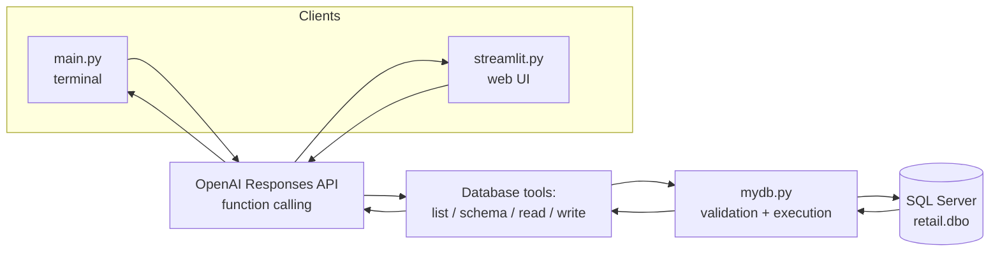
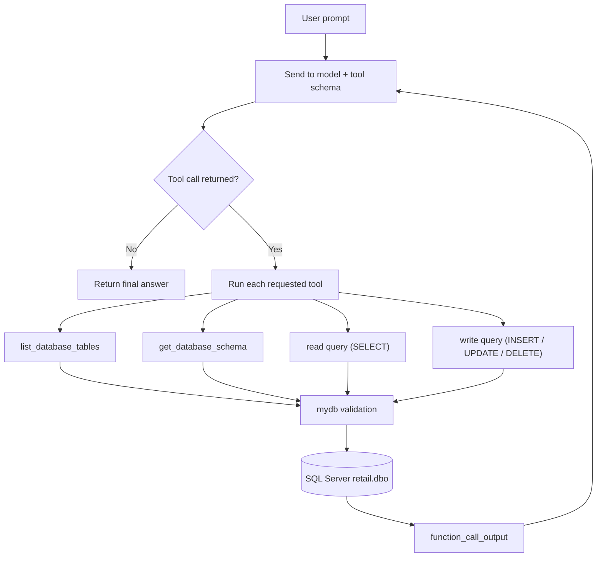
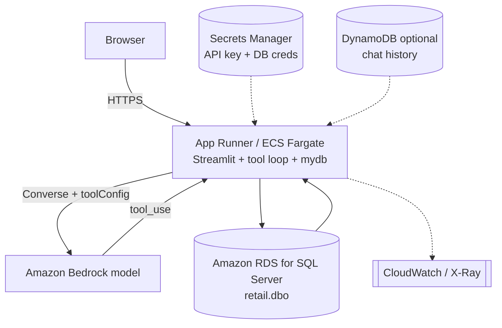

# AI Expense Tracker

**Track expenses in plain English.** An OpenAI function-calling assistant that turns
natural-language prompts into safe, validated SQL against a Microsoft SQL Server
database — available as both a terminal tool and a Streamlit web app.


> Ask "log a fuel expense of $60" or "what did I spend on groceries this month?" —
> the model decides which database tool to call, `mydb.py` validates and runs it,
> and you get a plain-language answer.

## Contents

- [How it works](#how-it-works)
- [Architecture](#architecture)
- [Quickstart](#quickstart)
- [Configuration](#configuration)
- [Usage](#usage)
- [Safety & validation](#safety--validation)
- [Running on AWS](#running-on-aws)
- [Project layout](#project-layout)
- [File responsibilities](#file-responsibilities)
- [Dependencies](#dependencies)
- [Roadmap](#roadmap)
- [License](#license)

## How it works

Every interface — CLI and Streamlit — shares one loop:

1. Your prompt goes to the OpenAI Responses API together with the database tool schema.
2. The model responds with one or more tool calls instead of raw SQL.
3. The app runs each tool through `mydb.py`, which validates and executes it.
4. Results go back to the model, which either calls more tools or writes the final answer.

The model never touches the database directly — it can only request the tools you
expose (table discovery, schema lookup, read queries, and write queries), and every
statement passes through `mydb.py`'s validation before it runs.

## Architecture



Inside a single request, the tools run in a loop until the model has its answer:



## Quickstart

**Prerequisites**

- Python 3.10+
- A reachable Microsoft SQL Server instance with a `retail` database
- The Microsoft **ODBC Driver 17/18 for SQL Server** installed on the host (required by `pyodbc` — this is a system package, not a pip install)
- An OpenAI API key

**Install**

```bash
# from the project root
python -m venv etracker
# Windows PowerShell
.\etracker\Scripts\Activate.ps1
# macOS / Linux
source etracker/bin/activate

pip install -r requirements.txt
```

**Configure** — create a `.env` (see [Configuration](#configuration)), then run either interface:

```bash
python main.py            # terminal
streamlit run streamlit.py   # browser UI (recommended)
```

## Configuration

Create a `.env` file in the project root:

```env
OPENAI_API_KEY=your_openai_api_key_here
OPENAI_MODEL=gpt-5.6-sol
```

`python-dotenv` loads these automatically.

**Database connection.** The server and database are currently hardcoded in
`mydb.py`:

| Setting  | Default                    |
| -------- | -------------------------- |
| Server   | `localhost\MSSQLSERVER03`  |
| Database | `retail`                   |
| Schema   | `dbo`                      |

For anything beyond local development, move these into `.env` (e.g.
`SQLSERVER_HOST`, `SQLSERVER_DB`) and read them in `get_engine()` so the same code
runs across environments without edits. A committed `.env.example` documenting the
expected keys is a good addition.

The app expects an expense table such as `dbo.expenses`; it uses table discovery and
schema lookup so the model can choose the right columns before writing a query.

## Usage

**CLI**

```bash
python main.py
```

```text
Add a grocery expense of $25.50
Show me my total spending this month
What did I buy yesterday?
```

**Streamlit**

```bash
streamlit run streamlit.py
```

Open the local URL Streamlit prints. The chat UI keeps history in
`st.session_state` and shows tool activity inline, so you can see which database
calls the model made. The OpenAI client is cached with `st.cache_resource` to avoid
re-initializing on every rerun.

```text
I bought lunch for $18.50 today
Log a fuel expense of $60
Show my expenses for the last 7 days
What is the total spent on groceries?
```

## Safety & validation

Because this app performs writes as well as reads, `mydb.py` validates every
statement before executing it:

- exactly one statement per call — no stacked queries
- comments (`--` and `/* */`) are stripped/blocked
- read path (`run_query`) accepts **only** `SELECT`
- write path (`execute_query`) accepts **only** `INSERT`, `UPDATE`, `DELETE`

This statement-type separation is the core guardrail — `DROP`/`ALTER` and multi-
statement injection are rejected outright. For defense-in-depth, scope the SQL login
the app connects with to just the tables it needs (and only the DML it needs), and
add a statement timeout so a runaway query can't tie up the server. Enforcing
permissions at the database means a validation gap can never become a catastrophic
write.

## Running on AWS

The same app runs in AWS with each local piece mapped to a managed service. Because
the primary interface is a long-running Streamlit server, the natural home is a
container service rather than a pure-Lambda design.

### Local component → AWS service

| Local | AWS |
| --- | --- |
| Streamlit app (`streamlit.py`) | Container on **App Runner** or **ECS Fargate** — the hosted UI |
| `main.py` CLI | Developer-only; run locally or from **CloudShell** |
| Tool-calling loop + `mydb.py` | Runs inside the container (or an **Orchestrator Lambda** in the serverless variant) |
| OpenAI Responses API | **Amazon Bedrock** Converse API (native tool use) — or OpenAI over HTTPS |
| SQL Server (`retail.dbo`) | **Amazon RDS for SQL Server** in private subnets |
| Read/write validation | Unchanged `mydb.py` code, plus a least-privilege RDS login |
| `.env` (key, model, DB creds) | **Secrets Manager** with rotation |
| Chat history (`st.session_state`) | Per-session in memory; **DynamoDB** or **ElastiCache** if it must survive restarts or be shared across replicas |
| — | **CloudWatch Logs / X-Ray** |

### Architecture



### Two hosting shapes

- **Container (recommended).** Package the Streamlit app in a container and run it on **App Runner** (simplest) or **ECS Fargate** (more control). The whole tool-calling loop and `mydb` layer run in the container; give it a VPC connector so it can reach RDS privately.
- **Serverless (if you drop Streamlit).** Replace the UI with a thin client or API and move the loop into **API Gateway + Lambda**, as a stateless request/response service. Streamlit's long-lived server doesn't fit Lambda, so this path trades the built-in UI for serverless scaling.

### Model: Bedrock or OpenAI

The loop is identical either way. With **Bedrock** you call the `Converse` API with a
`toolConfig`; it signals a call with `stopReason == "tool_use"` (the analogue of an
OpenAI `function_call`) and is **stateless**, so you resend the full message history
each round instead of using `previous_response_id`. Bedrock also keeps prompts and
data inside your account and region. To keep the exact OpenAI model, the container
calls the OpenAI Responses API over HTTPS and nothing else changes.

### Deployment notes

- **RDS:** private subnets, KMS encryption at rest, automated backups, and Multi-AZ for resilience. Scope the app's SQL login to the expense tables and only the DML it needs — `mydb`'s statement-type validation is then defense-in-depth, not the only guard.
- **Networking:** RDS reached privately in the VPC; a NAT Gateway for any external egress (for example OpenAI); VPC (PrivateLink) endpoints for Bedrock and Secrets Manager so traffic stays on the AWS network.
- **Secrets:** DB credentials and the API key in Secrets Manager with rotation — RDS for SQL Server supports managed rotation of its login.
- **State across replicas:** if you scale beyond one container, `st.session_state` is per-instance. Use sticky sessions, or externalize chat history to DynamoDB/ElastiCache so any replica can serve any user.
- **Scaling & cost:** App Runner scales on concurrency, Fargate via service auto-scaling. Watch per-request model cost and add a statement timeout on RDS.

## Project layout

```text
AIExpenseTracker/
├── main.py            # CLI assistant for natural-language SQL interactions
├── mydb.py            # SQL Server connection, validation, and execution
├── streamlit.py       # Streamlit web interface
├── requirements.txt   # Python dependencies
├── .env               # Local secrets (git-ignored)
├── .gitignore
├── etracker/          # Local virtual environment
└── README.md
```

## File responsibilities

<details>
<summary><strong>main.py</strong> — terminal AI agent</summary>

- loads the OpenAI API key and model from `.env`
- defines database tools for table listing, schema lookup, read queries, and write queries
- sends the user's text to the model with the tool schema
- executes the tool calls the model returns and loops until the user exits

Useful for testing the AI-to-database workflow directly in a terminal.
</details>

<details>
<summary><strong>mydb.py</strong> — database access layer</summary>

| Function | Purpose |
| --- | --- |
| `get_engine()` | Build the SQL Server engine (SQLAlchemy + `pyodbc`) |
| `run_query(query, params=None)` | Run a read-only `SELECT`, return a DataFrame |
| `execute_query(query, params=None)` | Run an `INSERT` / `UPDATE` / `DELETE` and commit |
| `get_schema(table_name)` | Column metadata from `INFORMATION_SCHEMA.COLUMNS` |
| `get_tables()` | List tables in the `dbo` schema |

All queries pass through the validation described in [Safety & validation](#safety--validation).
</details>

<details>
<summary><strong>streamlit.py</strong> — browser interface</summary>

- configures the Streamlit page and loads the API key from `.env`
- sends the conversation to the model with the tool schema
- executes database functions through tool calls
- stores chat history in `st.session_state` and shows tool activity in the UI
- caches the OpenAI client with `st.cache_resource`

The recommended interface for everyday use.
</details>

## Dependencies

Core, from `requirements.txt`: `openai`, `python-dotenv`, `sqlalchemy`, `pyodbc`,
`pandas`, `streamlit`, `requests`, `pydantic`.

A few entries look like they may have drifted and are worth auditing before you
publish:

- **`psycopg[binary]`** is a **PostgreSQL** driver — this project uses SQL Server through `pyodbc`, so unless something offscreen talks to Postgres, it's unused.
- **`google-genai`** and **`huggingface_hub`** aren't referenced by any described feature; drop them if they're leftovers.

Pinning versions (`package==x.y.z`) and trimming unused packages will make the
environment smaller and reproducible.

## Roadmap

- Category-based expense reporting
- Monthly / yearly dashboard charts
- CSV import & export
- User authentication
- Richer schema-aware prompts and validation
- Automatic table creation and migrations

## Execution

### Table structure and data


### Streamlit app execution


### Streamlit App UI


### Application Experience 1


### Application Experience 2


### Application Experience 3


### Application Experience 4


### Application Experience 5


### Application Experience 6


### Application Experience 6


## License

No license file is included yet. Add one (MIT, Apache-2.0, etc.) before sharing or
distributing, since without it the default is "all rights reserved."

---

Built for local development and testing: a terminal workflow and a Streamlit UI over
one shared, validated SQL Server backend.

